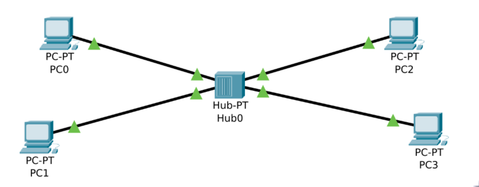

# 1. Simulación de Congestión en Redes de Datos y Evaluación del Comportamiento del Protocolo TCP

## Objetivo del ejercicio
Simular una red de datos utilizando la herramienta **ns-3** para observar y analizar el comportamiento del protocolo TCP bajo condiciones de congestión. El objetivo es identificar cómo TCP maneja la congestión y evaluar su rendimiento en términos de tiempo de respuesta, throughput (rendimiento) y pérdida de paquetes.

## Escenario de Simulación
Se creó una topología de red con dos nodos de envío y dos nodos receptores conectados a través de un hub, como en la siguiente imagen:

De manera, que el nodo de envio 0 se comunica con el nodo de recepcion 2 y el nodo de envio 1 con el nodo de recepcion 3. Por lo tanto, hay cuatro ***Comunicaciones***

## Funcionamiento de la simulación
La simulación de **ns-3**, escrita en C++, utiliza un nodo como switch, un canal Ethernet utilizando el módulo **CSMA** y el módulo **DCE** (Direct Code Execution) para generar el tráfico TCP, utilizando la herramienta `iperf`.

Así mismo, la simulación permite modificar, a través de argumentos del ejecutable, el ancho de banda del enlace central (en Mbps), el algoritmo de congestión utilizado (Yeah, Cubic o Illinois) y la cantidad de datos (en MB) enviados por `iperf` entre los *2* pares de nodos. El tráfico de los *4* nodos se guarda en *4* archivos de captura.

## Ejecución de la simulación
La simulación se ejecutó de 9 formas distintas, para un total de 36 archivos pcap que se transformaron en archivos json:
- ancho de banda de 50Mbps y 7MB de cantidad de datos
    - Yeah
    - Cubic
    - Illinois
- ancho de banda de 100Mbps y 18MB de cantidad de datos
    - Yeah
    - Cubic
    - Illinois
- ancho de banda de 25Mbps y 4MB de cantidad de datos
    - Yeah
    - Cubic
    - Illinois

## Archivos
- pcapsToJson.sh: Bash script para convertir los archivos pcap en json, en sus respectivos directorios
- wscript: Archivo de configuración para la compilación del script de simulación
- simulacion_hub.cc: La simulación en C++
- analisis.ipynb: Jupyter notebook con las gráficas de las métricas de los archivos de captura

## Enlaces
- [datos](): directorios con los archivos json de las *36* capturas
    - cubic-100Mb-18MB
    - cubic-25Mb-4MB
    - cubic-50Mb-7MB
    - illinois-100Mb-18MB
    - illinois-25Mb-4MB
    - illinois-50Mb-7MB
    - yeah-100Mb-18MB
    - yeah-25Mb-4MB
    - yeah-50Mb-7MB
