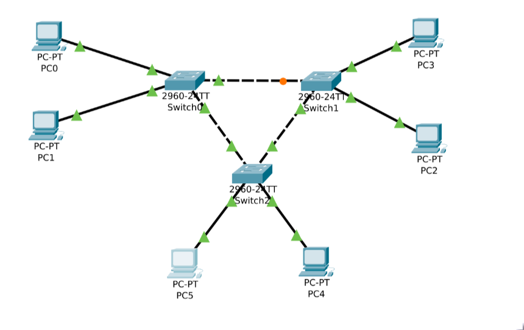

# 2. Evaluación del Concepto de Conmutación de Paquetes utilizando Switches

## Objetivo del ejercicio
Simular una red de switches que conecta varios dispositivos con el objetivo de observar el proceso de conmutación de paquetes y cómo los switches manejan el tráfico en la red, mejorando la eficiencia de la transmisión de datos.

## Escenario de simulación
Se creó una red con tres switches y seis dispositivos, de manera que cada switch interconecta dos dispositivos, y a su vez se conecta con los otros dos switches.
Además el mismo escenario se replicó reemplazando los switches por hubs

Y cada dispositivo se eligió comunicarlo con otro dispositivo, a través de la siguiente fórmula
    (i + 3) % 6
donde *i* corresponde al número del dispositivo, por ejemplo, el dispositivo 2 se comunica con el dispositivo 5.

## Funcionamiento de la simulación
La simulación de **ns-3**, escrita en C++, utiliza canales Ethernet utilizando el módulo **CSMA**, el módulo **Bridge** para interconectar los dispositivos, y para la red con switches utiliza nodos para la representación de los mismos. Y el tráfico generado es ICMP.

Además, la simulación permite modificar, a través de argumentos del ejecutable, el uso de switches o de hubs, y si hay presencia de congestión en la red.

## Ejecución de la simulación
La simulación se ejecutó de 4 formas diferentes, lo que genero un total de 48 archivos de captura:
- con switches y con congestión
    - 4 archivos de captura por cada switch, que corresponden a sus cuatro conexiones
    - 6 archivos de captura por cada dispositivo
- con hubs y con congestión
    - 6 archivos de captura por cada dispositivo
- con switches y sin congestión
    - 4 archivos de captura por cada switch, que corresponden a sus cuatro conexiones
    - 6 archivos de captura por cada dispositivo
- con hubs y sin congestión
    - 6 archivos de captura por cada dispositivo

## Archivos
- pcapsToJson.sh: Bash script para convertir los archivos pcap en json, en sus respectivos directorios
- simulacion.cc: La simulación en C++
- analisis.ipynb: Jupyter notebook con las gráficas de las métricas de los archivos de captura

## Enlaces
- [datos](): directorios con los archivos json de las *48* capturas
    - hubCongestion
    - hubSinCongestion
    - switchCongestion
    - switchSinCongestion
